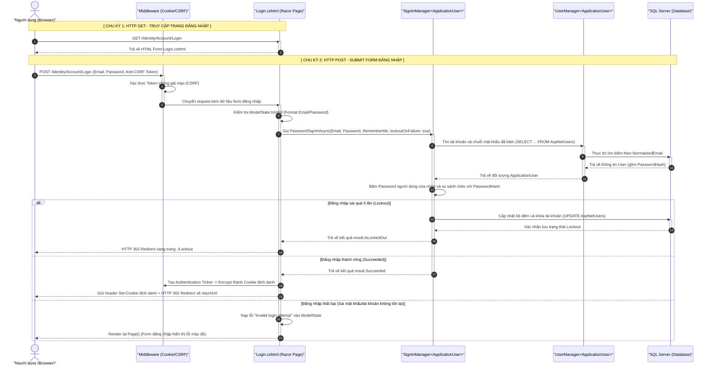

# BÁCH KHOA TOÀN THƯ: GIẢI THÍCH LUỒNG HỆ THỐNG & KỊCH BẢN ĐÁP TRẢ MENTOR (PHIÊN BẢN KHÔNG THỂ BỊ HỎI XOÁY)

Tài liệu này đi sâu đến mức **"tế bào"** của hệ thống ASP.NET Core MVC và Entity Framework Core. Nó bao gồm: **Kiến trúc hệ thống, Luồng đi của Request, Giải thích từng dòng code, Vị trí hover biến, Mã SQL dịch ra thực tế, cơ chế Render HTML, và 15+ câu hỏi xoáy sâu nhất của Mentor kèm đáp án.**

---

## MỤC LỤC HỆ THỐNG (THE DATA JOURNEY)
```mermaid
graph TD
    Client[Browser/Client] -->|1. HTTP Request| Middleware[Middleware Pipeline: Authentication, Routing]
    Middleware -->|2. Check [Authorize]| CookieAuth[Cookie Auth Middleware]
    CookieAuth -->|3. DI Controller| Controller[BlogsController]
    Controller -->|4. Action Filter| Filter[AuthorizeBlogOwner Filter]
    Filter -->|5. Validation & Binding| ModelBinding[Model Binder & ModelState]
    ModelBinding -->|6. Call Service| Service[BlogService]
    Service -->|7. EF Core Engine| DbContext[ApplicationDbContext & Change Tracker]
    DbContext -->|8. SQL Execution| DB[(Database SQL Server/Postgres)]
    DB -->|9. Data Return| DbContext
    DbContext -->|10. View Engine| Razor[Razor View Engine: Compile C# to HTML]
    Razor -->|11. HTTP Response 200/302| Client
```

---

## 🛠️ PHẦN CHUẨN BỊ: THIẾT LẬP HỆ THỐNG BREAKPOINT TRÊN VISUAL STUDIO
Cắm chính xác **8 Breakpoint** sau để demo:
1. `AuthorizeBlogOwnerAttribute.cs` -> Dòng 35: `if (context.ActionArguments.TryGetValue("id", ...`
2. `BlogsController.cs` -> Dòng 57: `return View(new BlogCreateVM());`
3. `BlogsController.cs` -> Dòng 66: `if (!ModelState.IsValid) ...`
4. `BlogService.cs` -> Dòng 72: `var blog = new Blog { ...`
5. `BlogsController.cs` -> Dòng 81: `var blog = await _blogService.GetBlogByIdOnlyAsync(id);`
6. `BlogService.cs` -> Dòng 88: `var blog = await _context.Blogs.FindAsync(model.Id);`
7. `Login.cshtml.cs` -> Dòng 56: `public async Task OnGetAsync(string returnUrl = null)`
8. `Login.cshtml.cs` -> Dòng 73: `public async Task<IActionResult> OnPostAsync(string returnUrl = null)`

---

## 🟢 PHẦN 1: LUỒNG THÊM MỚI (CREATE FLOW) - CHI TIẾT TỪNG GIÂY CHẠY

### 1. Luồng GET: Mở Trang Tạo Mới (Render HTML Form)
**🖱️ Thao tác:** Bấm nút "Thêm bài viết". Gặp Breakpoint 2 ở Controller.
```csharp
// GET: /Blogs/Create
public IActionResult Create()
{
    return View(new BlogCreateVM());
}
```

#### 📖 GIẢI THÍCH CHI TIẾT TỪNG DÒNG CODE:
* **`public IActionResult Create()`**
  * **Giải thích:** Khai báo một Action (hành động) tên là `Create` trong `BlogsController`. Kiểu trả về là `IActionResult` - một interface định nghĩa kết quả trả về của một request (có thể là View HTML, File, JSON hoặc chuyển hướng Redirect).
* **`return View(new BlogCreateVM());`**
  * **Giải thích:** Khởi tạo một đối tượng View Model mới tinh (`BlogCreateVM`) chưa có dữ liệu gì (các thuộc tính `Title`, `Content` đều mặc định là `null`, `Priority` là `0`). Lệnh `return View(...)` đẩy đối tượng này sang View `Create.cshtml` để Razor Engine dịch C# thành HTML và trả về cho trình duyệt.

* **🔍 Phân tích chi tiết:**
  * Request bắt đầu bằng phương thức `GET` đi qua router map trúng Action `Create`.
  * `new BlogCreateVM()`: Khởi tạo thực thể viewmodel mới tinh trên RAM.
  * `return View(model)`: Đẩy model này vào View Engine để render.

* **🖱️ Hover chuột giải thích:**
  * Di chuột vào `BlogCreateVM()`: Cho thấy các thuộc tính đều bằng `null` hoặc `0`.

* **🗣️ Lời thoại với Mentor:**
  > *"Thưa anh, khi người dùng click vào nút 'Thêm mới', một HTTP GET Request được gửi lên. Router của ASP.NET Core sẽ dẫn request vào hàm `Create` này. Em khởi tạo một thực thể View Model trống là `BlogCreateVM` rồi chuyển nó vào View.*
  >
  > *Tại View (mở file `Views/Blogs/Create.cshtml`, chỉ vào dòng 25: `<input asp-for="Title"...`), **Razor View Engine** sẽ dịch các mã C# kết hợp HTML. Nhờ các Tag Helpers như `asp-for="Title"`, Razor Engine tự tạo ra thẻ input HTML tương ứng và gán giá trị mặc định của thuộc tính vào thẻ input đó."*

* **🛡️ CÂU HỎI XOÁY CỦA MENTOR:**
  1. **Hỏi:** *Tại sao em dùng ViewModel `BlogCreateVM` rỗng mà không dùng trực tiếp Entity `Blog`?*
     * **Đáp:** "Dạ thưa anh, việc dùng ViewModel giúp bảo mật hệ thống (chống tấn công Over-Posting / Mass Assignment). Entity `Blog` chứa các thuộc tính như `Id`, `UserId`, `CreatedAt`. Nếu em truyền Entity ra View, kẻ xấu có thể chèn các input ẩn trùng tên thuộc tính đó rồi submit lên. Khi đó, Model Binder tự động gán dữ liệu đó vào đối tượng, dẫn đến việc hacker tự gán được Id hoặc UserId của người khác. ViewModel giới hạn đúng những trường user được phép nhập."
  2. **Hỏi:** *Hàm GET này có chạy qua Database không?*
     * **Đáp:** "Dạ không, hàm GET chỉ đơn thuần khởi tạo đối tượng ViewModel trên RAM và render HTML tĩnh để trả về cho Client, hoàn toàn không có tương tác nào với Database."

---

### 2. Luồng POST: Gửi Dữ Liệu Tạo Mới & Lưu Database
**🖱️ Thao tác:** Nhập dữ liệu "Học lập trình .NET", nội dung "Chi tiết luồng", chọn Priority "High". Bấm Submit. Gặp Breakpoint 3 ở Controller.
```csharp
[HttpPost]
[ValidateAntiForgeryToken]
public async Task<IActionResult> Create(BlogCreateVM model)
{
    if (!ModelState.IsValid) return View(model);
```

#### 📖 GIẢI THÍCH CHI TIẾT TỪNG DÒNG CODE:
* **`[HttpPost]`**
  * **Giải thích:** Bộ lọc (Attribute) đánh dấu Action này chỉ chấp nhận các request sử dụng phương thức HTTP POST (gửi dữ liệu từ form lên).
* **`[ValidateAntiForgeryToken]`**
  * **Giải thích:** Bộ lọc chống tấn công giả mạo yêu cầu chéo trang (CSRF). Nó bắt buộc form gửi lên phải có đính kèm một token bí mật để đối chiếu chéo với Cookie.
* **`public async Task<IActionResult> Create(BlogCreateVM model)`**
  * **Giải thích:** Khai báo một Action bất đồng bộ (`async Task`) để xử lý POST request. Model Binder sẽ tự động ánh xạ (bind) các dữ liệu từ form HTML gửi lên vào đối tượng `model` kiểu `BlogCreateVM`.
* **`if (!ModelState.IsValid) return View(model);`**
  * **Giải thích:** `ModelState.IsValid` kiểm tra xem dữ liệu trong `model` có thỏa mãn các điều kiện validation được định nghĩa trong `BlogCreateVM` không (ví dụ: bắt buộc nhập, giới hạn ký tự). Nếu không hợp lệ (`false`), nó ngay lập tức trả về lại View kèm theo dữ liệu cũ và thông báo lỗi.

* **🔍 Phân tích chi tiết:**
  * `[ValidateAntiForgeryToken]`: Kiểm tra và so sánh token được đính kèm ngầm trong form (`__RequestVerificationToken`) và token lưu ở Cookie. Nếu không trùng khớp, request bị hủy ngay lập tức với lỗi `400 Bad Request`.
  * `ModelState.IsValid`: Chứa trạng thái xác thực dữ liệu.

* **🖱️ Hover chuột giải thích:**
  * Di chuột vào `model`: Xem dữ liệu `Title = "Học lập trình .NET"`, `Content = "Chi tiết luồng"`, `Priority = 3`.
  * Di chuột vào `ModelState.IsValid`: Hiển thị giá trị `true`.

* **🗣️ Lời thoại với Mentor:**
  > *"Khi người dùng ấn Submit, một HTTP POST Request mang theo cục dữ liệu (payload) gửi lên. Nhờ **Model Binder**, framework tự động parse dữ liệu từ form và gán vào tham số `model`.*
  >
  > *Đồng thời, framework chạy qua các luật Data Annotations để validate dữ liệu. Ở đây, em hover chuột vào thấy `ModelState.IsValid` trả về `true`, nghĩa là dữ liệu sạch và hợp lệ, có thể đi tiếp."*

* **🛡️ CÂU HỎI XOÁY CỦA MENTOR:**
  1. **Hỏi:** *Nếu `ModelState.IsValid` bằng `false` thì sao? Luồng chạy tiếp thế nào?*
     * **Đáp:** "Dạ, nếu bằng `false`, hệ thống sẽ bỏ qua toàn bộ logic bên dưới, lập tức chạy dòng `return View(model)`. Lúc này Razor View Engine sẽ render lại form đó, đồng thời giữ nguyên dữ liệu user đã nhập (trong `model`) kèm theo các thông báo lỗi hiển thị qua thẻ `span asp-validation-for`, giúp user biết họ nhập sai chỗ nào để sửa."
  2. **Hỏi:** *Cơ chế `ValidateAntiForgeryToken` hoạt động như thế nào?*
     * **Đáp:** "Dạ, khi trang web render ra form (mở file `Views/Blogs/Create.cshtml`, chỉ vào dòng 19: `@Html.AntiForgeryToken()`), thẻ helper này hoặc Tag Helper của form sẽ tạo ra một input ẩn chứa token đã được mã hóa. Đồng thời, một token tương ứng được lưu vào Cookie của User. Khi POST lên, middleware của ASP.NET sẽ giải mã cả 2 token này và so sánh chéo. Nếu kẻ tấn công cố tình thực hiện request giả mạo (CSRF) từ một website khác, họ không thể đọc được cookie hoặc token ẩn này, giúp bảo vệ website."

---

**🖱️ Thao tác:** Nhấn **F10** chạy qua dòng lấy `currentUserId`. Nhấn **F11 (Step Into)** để nhảy vào hàm `CreateBlogAsync` trong `BlogService.cs` (Breakpoint 4).
```csharp
public async Task CreateBlogAsync(BlogCreateVM model, string userId)
{
    var blog = new Blog
    {
        Title = model.Title,
        Content = model.Content,
        Priority = model.Priority,
        CreatedAt = DateTime.UtcNow,
        UserId = userId
    };

    _context.Blogs.Add(blog);
    await _context.SaveChangesAsync();
}
```

#### 📖 GIẢI THÍCH CHI TIẾT TỪNG DÒNG CODE (TRONG SERVICE):
* **`var blog = new Blog { ... }`**
  * **Giải thích:** Tạo một thực thể (Entity) `Blog` mới để chuẩn bị ghi xuống Database, đồng thời gán dữ liệu từ `model` (ViewModel) qua và bổ sung thêm ID của User đăng nhập (`userId`) cùng thời gian tạo hiện tại (`DateTime.UtcNow`).
* **`_context.Blogs.Add(blog);`**
  * **Giải thích:** Đưa đối tượng `blog` vào danh sách theo dõi của Entity Framework (DbContext Change Tracker) và đánh dấu trạng thái là `Added`. Lúc này vẫn chưa có gì được lưu vào CSDL thực tế.
* **`await _context.SaveChangesAsync();`**
  * **Giải thích:** Thực thi truy vấn bất đồng bộ. EF Core tự dịch đối tượng mang trạng thái `Added` thành câu lệnh `INSERT INTO` và chạy trực tiếp xuống SQL Server.

* **🔍 Phân tích chi tiết:**
  * `_context.Blogs.Add(blog)`: Đánh dấu Entity là `EntityState.Added`. Không có kết nối DB nào được mở tại đây.
  * `SaveChangesAsync()`: Thực hiện mở kết nối, tạo Transaction ngầm, chạy SQL, Commit Transaction và đóng kết nối.

* **🖱️ Hover chuột giải thích:**
  * Di chuột vào biến `blog`: Thấy thuộc tính `Id` hiện tại đang là `0`.
  * Nhấn F10 qua dòng `_context.Blogs.Add(blog)` và hover lại `blog`: Trạng thái nội bộ của EF Tracker đã được set là `Added`. `Id` vẫn bằng `0`.
  * Nhấn F10 qua dòng `await _context.SaveChangesAsync()` và hover lại `blog`: `Id` đã tự động đổi thành số thực tế dưới DB (ví dụ: `15`).

* **🗣️ Lời thoại với Mentor (Phần SQL & EF Core Engine):**
  > *"Tại Service, em map dữ liệu sang Entity `Blog`. Khi em chạy dòng lệnh `Add(blog)`, Entity Framework mới chỉ đưa đối tượng này vào danh sách theo dõi (Change Tracker) trong RAM của `DbContext`.*
  >
  > *Khi dòng lệnh `await _context.SaveChangesAsync()` chạy, EF Core sẽ biên dịch (translate) trạng thái `Added` này thành câu lệnh SQL thuần:*
  > ```sql
  > INSERT INTO [Blogs] ([Title], [Content], [Priority], [CreatedAt], [UserId])
  > VALUES (@p0, @p1, @p2, @p3, @p4);
  > SELECT [Id] FROM [Blogs] WHERE @@ROWCOUNT = 1 AND [Id] = scope_identity();
  > ```
  > *Nó thực thi câu INSERT, sau đó dùng hàm `scope_identity()` lấy ID vừa sinh gán ngược lại cho object trên RAM để đồng bộ dữ liệu."*

---

**🖱️ Thao tác:** Bấm **F10** nhảy lại Controller. Dừng ở dòng `RedirectToAction`.
```csharp
    TempData["SuccessMessage"] = "Đăng bài viết mới thành công!";
    return RedirectToAction(nameof(Index));
```

#### 📖 GIẢI THÍCH CHI TIẾT TỪNG DÒNG CODE:
* **`TempData["SuccessMessage"] = "Đăng bài viết mới thành công!";`**
  * **Giải thích:** Gán câu thông báo thành công vào bộ lưu trữ tạm thời `TempData`. Bộ nhớ này hoạt động dựa trên cơ chế Session nhưng có vòng đời đặc biệt: chỉ tồn tại cho đến khi được đọc ở Request tiếp theo, sau đó sẽ tự động bị xóa.
* **`return RedirectToAction(nameof(Index));`**
  * **Giải thích:** Trả về kết quả chuyển hướng `RedirectToRouteResult`. ASP.NET Core sẽ gửi mã trạng thái `HTTP 302 Found` về cho trình duyệt, kèm theo đường dẫn chuyển đến trang danh sách (`Index`). Trình duyệt sẽ tự động gọi phương thức HTTP GET tới trang `Index`.

* **🗣️ Lời thoại với Mentor:**
  > *"Sau khi lưu thành công, em dùng `TempData` để lưu trữ câu thông báo thành công. Về cơ chế, `TempData` sử dụng Session để lưu tạm dữ liệu và sẽ tự động xóa sạch ngay sau khi dữ liệu này được đọc ở request tiếp theo.*
  >
  > *Lệnh `RedirectToAction` sẽ trả về mã HTTP Response Status Code là **302 Found** kèm tiêu đề Location chứa URL của trang Index. Trình duyệt của người dùng khi nhận mã 302 sẽ tự động tạo một GET request mới tới trang Index để hiển thị danh sách bài viết (Đây gọi là mô hình Post-Redirect-Get để tránh việc người dùng nhấn F5 bị submit lại form)."*

---
---

## 🟡 PHẦN 2: LUỒNG CẬP NHẬT (UPDATE FLOW) & PHÂN QUYỀN

### 1. Luồng Phân Quyền Đánh Chặn (Action Filter)
**🖱️ Thao tác:** Tại một bài viết, bấm "Edit". Code lập tức dừng ở Breakpoint 1 tại `AuthorizeBlogOwnerAttribute.cs`.

```csharp
public async Task OnActionExecutionAsync(ActionExecutingContext context, ActionExecutionDelegate next)
{
    if (context.ActionArguments.TryGetValue("id", out var idObj) && idObj is int id)
    {
        var currentUserId = _userManager.GetUserId(context.HttpContext.User);
        var isAdmin = context.HttpContext.User.IsInRole("Admin");

        var isAuthorized = await _blogService.IsUserAuthorizedAsync(id, currentUserId, isAdmin);
        if (!isAuthorized)
        {
            context.Result = new ForbidResult();
            return;
        }
    }
    await next();
}
```

#### 📖 GIẢI THÍCH CHI TIẾT TỪNG DÒNG CODE TRONG ACTION FILTER (TẠI SAO PHẢI CHẠY VÀO ĐÂY? CHỨC NĂNG GÌ?):
* **`public async Task OnActionExecutionAsync(ActionExecutingContext context, ActionExecutionDelegate next)`**
  * **Chức năng:** Đây là phương thức thực thi bất đồng bộ của Action Filter.
  * **Tại sao phải chạy vào đây:** ASP.NET Core MVC tự động dẫn hướng luồng chạy vào đây trước khi request đi vào Action của Controller (do Controller được gắn thẻ `[AuthorizeBlogOwner]`). Mục đích là để thiết lập một chốt chặn phân quyền tập trung, giúp tách biệt logic nghiệp vụ bảo mật ra khỏi Controller.
* **`if (context.ActionArguments.TryGetValue("id", out var idObj) && idObj is int id)`**
  * **Chức năng:** Rà quét và trích xuất tham số có tên là `"id"` từ URL Route gửi lên.
  * **Tại sao phải chạy vào đây:** Để biết được người dùng đang muốn chỉnh sửa hoặc xóa bài viết cụ thể nào (mang ID bằng bao nhiêu).
* **`var currentUserId = _userManager.GetUserId(context.HttpContext.User);`**
  * **Chức năng:** Lấy ra ID của người dùng hiện tại đang đăng nhập từ Context của HTTP Request.
  * **Tại sao phải chạy vào đây:** Để lấy định danh của người gửi request, phục vụ for việc đối chiếu quyền sở hữu bài viết.
* **`var isAdmin = context.HttpContext.User.IsInRole("Admin");`**
  * **Chức năng:** Kiểm tra xem người dùng hiện tại có giữ vai trò Quản trị viên (`Admin`) hay không.
  * **Tại sao phải chạy vào đây:** Vì Admin được đặc quyền sửa/xóa bài viết của bất kỳ ai, nên nếu là Admin thì hệ thống sẽ bỏ qua bước check sở hữu bài viết và cấp quyền ngay.
* **`var isAuthorized = await _blogService.IsUserAuthorizedAsync(id, currentUserId, isAdmin);`**
  * **Chức năng:** Gọi xuống tầng Service để truy vấn database xem người dùng này có quyền chỉnh sửa bài viết này không.
  * **Tại sao phải chạy vào đây:** Nhập tách biệt logic truy cập database xuống Service. Câu LINQ `.AnyAsync()` trong hàm này sẽ dịch ra SQL `EXISTS` cực nhanh, chỉ trả về 1 bit dữ liệu `true` hoặc `false` để xác thực quyền.
* **`if (!isAuthorized) { context.Result = new ForbidResult(); return; }`**
  * **Chức năng:** Nếu kiểm tra trả về `false` (không có quyền), gán kết quả trả về của request là `ForbidResult()` và lập tức kết thúc luồng xử lý.
  * **Tại sao phải chạy vào đây:** Đây gọi là cơ chế **Short-circuiting (Cắt đứt luồng)**. Hệ thống sẽ trả ngay mã lỗi **HTTP 403 Forbidden** về cho Browser, chặn đứng không cho phép code nhảy tiếp vào Controller, đảm bảo an toàn tuyệt đối.
* **`await next();`**
  * **Chức năng:** Cho phép request tiếp tục đi tiếp vào Action trong Controller.
  * **Tại sao phải chạy vào đây:** Chạy dòng này khi người dùng đã vượt qua vòng kiểm tra bảo mật (là chủ bài viết hoặc Admin).

* **🗣️ Lời thoại với Mentor:**
  > *"Ở luồng Update, bảo mật là cực kỳ quan trọng. Trước khi request chạm tới Action `Edit` của Controller, nó sẽ bị chặn lại tại hàm `OnActionExecutionAsync` của Action Filter.*
  >
  > *Filter này đọc trực tiếp dữ liệu Route từ `ActionArguments` để lấy ra `id` của bài viết.*
  > 
  > *(Nhấn F10)* *Sau đó, nó gọi xuống `BlogService` kiểm tra xem người dùng hiện tại có phải chủ bài viết hoặc Admin không. Nếu sai quyền, em lập tức gán `context.Result = new ForbidResult()`, trả về mã lỗi **HTTP 403 Forbidden** ngay lập tức mà không chạy tiếp xuống Controller nữa."*

---

### 2. Luồng GET: Lấy dữ liệu cũ hiển thị (Render Form Edit)
**🖱️ Thao tác:** Nhấn **F5** để cho phép Filter chạy qua (gọi `await next()`). Code nhảy sang hàm GET `Edit` ở Controller (Breakpoint 5).
```csharp
[AuthorizeBlogOwner] 
public async Task<IActionResult> Edit(int id)
{
    var blog = await _blogService.GetBlogByIdOnlyAsync(id);
    if (blog == null) return NotFound();

    var model = new BlogEditVM
    {
        Id = blog.Id,
        Title = blog.Title,
        Content = blog.Content,
        Priority = blog.Priority
    };

    return View(model);
}
```

#### 📖 GIẢI THÍCH CHI TIẾT TỪNG DÒNG CODE (TẠI SAO PHẢI CHẠY VÀO ĐÂY? CHỨC NĂNG GÌ?):
* **`var blog = await _blogService.GetBlogByIdOnlyAsync(id);`**
  * **Chức năng:** Gọi hàm xuống Service lấy thông tin cũ của bài viết theo ID (chỉ lấy bảng Blogs, không nạp User hay Comments đi kèm).
  * **Tại sao phải chạy vào đây:** Để điền dữ liệu (Tiêu đề, nội dung cũ) sẵn vào các ô nhập liệu trên form sửa, giúp người dùng biết mình đang sửa cái gì.
* **`if (blog == null) return NotFound();`**
  * **Chức năng:** Trả về kết quả `NotFoundResult` (mã lỗi HTTP 404).
  * **Tại sao phải chạy vào đây:** Để phòng ngừa trường hợp bài viết có ID này đã bị người khác xóa trước đó dưới Database. Hệ thống sẽ báo ngay lỗi 404 cho trình duyệt thay vì cố gắng xử lý tiếp và bị crash.
* **`var model = new BlogEditVM { ... };`**
  * **Chức năng:** Khởi tạo ViewModel chỉnh sửa và sao chép dữ liệu từ thực thể Entity `blog` gốc sang.
  * **Tại sao phải chạy vào đây:** Đây là chốt chặn bảo mật (ViewModel Pattern). Chúng ta không truyền thẳng Entity `Blog` ra ngoài View để tránh lỗi bảo mật và đảm bảo View chỉ nhận đúng những trường dữ liệu được phép sửa đổi.
* **`return View(model);`**
  * **Chức năng:** Gọi Razor View Engine tìm và biên dịch file `Views/Blogs/Edit.cshtml` kết hợp với đối tượng `model`.
  * **Tại sao phải chạy vào đây:** Nhờ cơ chế **View Discovery**, hệ thống tự hiểu tên Action hiện tại là `Edit` để tìm file `Edit.cshtml`, sinh ra HTML hoàn chỉnh để trả về cho người dùng giao diện chỉnh sửa.

* **🗣️ Lời thoại với Mentor (Phần dịch LINQ sang SQL & Giải thích Tối ưu hóa):**
  > *"Khi được Filter cho phép đi qua, luồng chạy vào hàm GET `Edit`. Em thực hiện truy vấn lấy dữ liệu cũ của bài viết.*
  > 
  > *Dòng lệnh `GetBlogByIdOnlyAsync` sử dụng LINQ: `_context.Blogs.FirstOrDefaultAsync(b => b.Id == id)`. Ở đây, em đã chủ động dùng hàm này để tối ưu hiệu năng: Vì trang Edit chỉ hiển thị Tiêu đề, Nội dung, Độ ưu tiên mà không cần Comments hay thông tin tác giả, nên em truy vấn không JOIN để database chạy nhẹ nhất có thể. EF Core sẽ dịch ra SQL:*
  > ```sql
  > SELECT TOP(1) [b].[Id], [b].[Title], [b].[Content], [b].[Priority], [b].[CreatedAt], [b].[UserId]
  > FROM [Blogs] AS [b]
  > WHERE [b].[Id] = @__id_0
  > ```
  > *Sau đó, dữ liệu này được map sang `BlogEditVM` tách biệt để đưa ra View hiển thị lên form (mở file `Views/Blogs/Edit.cshtml`, chỉ vào dòng 1: `@model PersonalBlogApp.ViewModels.BlogEditVM`)."*

---

### 3. Luồng POST: Lưu Thay Đổi & Change Tracking tối ưu
**🖱️ Thao tác:** Sửa Title từ "Học lập trình .NET" thành "Lập trình .NET nâng cao". Bấm "Lưu". Code dừng ở hàm POST `Edit` trong Controller.
```csharp
[HttpPost]
[ValidateAntiForgeryToken]
[AuthorizeBlogOwner]
public async Task<IActionResult> Edit(int id, BlogEditVM model)
{
    if (id != model.Id) return NotFound();
    if (!ModelState.IsValid) return View(model);

    await _blogService.UpdateBlogAsync(model);
    return RedirectToAction(nameof(Index));
}
```

#### 📖 GIẢI THÍCH CHI TIẾT TỪNG DÒNG CODE TRÊN TẦNG KHAI BÁO & BODY ACTION POST (TẠI SAO PHẢI CHẠY VÀO ĐÂY? CHỨC NĂNG GÌ?):
* **`[HttpPost]`**
  * **Chức năng:** Chỉ định Action này chỉ phản hồi phương thức HTTP POST.
  * **Tại sao phải chạy vào đây:** Để ngăn chặn kẻ xấu sử dụng request GET bừa bãi và phân tách luồng gửi dữ liệu (POST) rõ ràng với luồng vẽ giao diện (GET).
* **`[ValidateAntiForgeryToken]`**
  * **Chức năng:** Kiểm tra chéo mã token bảo mật gửi kèm từ Form với cookie lưu trên trình duyệt.
  * **Tại sao phải chạy vào đây:** Chốt chặn bảo mật chống tấn công giả mạo CSRF khi gửi dữ liệu quan trọng (chỉnh sửa bài viết).
* **`[AuthorizeBlogOwner]`**
  * **Chức năng:** Đánh chặn kiểm tra quyền sở hữu bằng Custom Filter.
  * **Tại sao phải chạy vào đây:** Ngăn không cho người dùng khác giả mạo form POST sửa dữ liệu bài viết mà họ không có quyền sở hữu.
* **`if (id != model.Id) return NotFound();`**
  * **Chức năng:** So sánh ID trên URL và ID ẩn trong form gửi lên.
  * **Tại sao phải chạy vào đây:** Chống tấn công giả mạo dữ liệu gửi lên. Nếu hacker cố tình sửa trường ID ẩn trong Form HTML bằng F12 để ghi đè bài viết khác, hệ thống sẽ phát hiện lệch khớp và chặn lại bằng lỗi 404.
* **`if (!ModelState.IsValid) return View(model);`**
  * **Chức năng:** Kiểm tra dữ liệu sửa đổi gửi lên có hợp lệ với các luật trong ViewModel hay không.
  * **Tại sao phải chạy vào đây:** Nếu người dùng cố tình xóa trắng tiêu đề, hệ thống sẽ trả lại giao diện Edit kèm lỗi thay vì ghi dữ liệu rỗng xuống DB.
* **`await _blogService.UpdateBlogAsync(model);`**
  * **Chức năng:** Gọi hàm bất đồng bộ xuống tầng Service để cập nhật dữ liệu vào DB.
  * **Tại sao phải chạy vào đây:** Nhập tách biệt logic xử lý nghiệp vụ CSDL ra khỏi Controller, giúp code dễ bảo trì.
* **`return RedirectToAction(nameof(Index));`**
  * **Chức năng:** Trả về kết quả chuyển hướng `302 Found` tới trang Index.
  * **Tại sao phải chạy vào đây:** Áp dụng PRG Pattern, chuyển luồng hiển thị sang GET trang Index để tránh gửi đúp dữ liệu khi người dùng ấn F5 tải lại trang.

---

### 💡 MỞ RỘNG KIẾN THỨC: NẾU MUỐN QUAY VỀ LẠI TRANG EDIT THAY VÌ INDEX THÌ LÀM THẾ NÀO?

Nếu sau khi sửa thành công, bạn **không muốn quay về trang danh sách (Index)** mà muốn **ở lại ngay chính trang Edit đó** để người dùng xem kết quả chỉnh sửa hoặc chỉnh sửa tiếp, chúng ta sẽ sửa code như sau:

#### 1. Thay đổi dòng Return trong Controller:
Thay vì viết:
```csharp
return RedirectToAction(nameof(Index));
```
Bạn sẽ sửa thành:
```csharp
return RedirectToAction(nameof(Edit), new { id = model.Id });
```

#### 2. Giải thích cơ chế dòng code mới này hoạt động như thế nào:
* **`RedirectToAction(nameof(Edit), ...)`**: Yêu cầu trình duyệt chuyển hướng (gửi một GET request mới) về lại Action `Edit` thay vì `Index`.
* **`new { id = model.Id }`**: Đây là điểm quan trọng nhất! Vì Action GET `Edit` ở dòng 81 yêu cầu phải có tham số `int id` để biết bài viết nào cần lấy dữ liệu hiển thị lên form, nên bạn bắt buộc phải truyền `model.Id` vào tham số định tuyến (Route Values). Nếu bạn không truyền tham số này, ASP.NET Core sẽ không tìm thấy route khớp và báo lỗi hoặc không lấy được bài viết.
* **Kết quả thực tế:** Người dùng ấn "Lưu thay đổi", trang Edit tự động tải lại (F5), hiển thị thông báo thành công màu xanh và giao diện form vẫn giữ nguyên các dữ liệu mới vừa sửa của chính bài viết đó.

---

**🖱️ Thao tác:** Nhấn **F11** đi vào hàm `UpdateBlogAsync` trong `BlogService.cs` (Breakpoint 6).
```csharp
public async Task UpdateBlogAsync(BlogEditVM model)
{
    var blog = await _context.Blogs.FindAsync(model.Id);
    if (blog != null)
    {
        blog.Title = model.Title;
        blog.Content = model.Content;
        blog.Priority = model.Priority;

        await _context.SaveChangesAsync();
    }
}
```

#### 📖 GIẢI THÍCH CHI TIẾT TỪNG DÒNG CODE TRONG SERVICE (TẠI SAO PHẢI CHẠY VÀO ĐÂY? CHỨC NĂNG GÌ?):
* **`var blog = await _context.Blogs.FindAsync(model.Id);`**
  * **Chức năng:** Tìm kiếm và tải bài viết cũ từ DB lên bộ nhớ RAM.
  * **Tại sao phải chạy vào đây:** `FindAsync` sẽ ưu tiên tìm trong RAM (Local Cache) của DbContext trước rồi mới query xuống Database để giảm tải cho DB. Việc nạp thực thể này lên giúp tạo ra một bản sao **Snapshot** phục vụ cho cơ chế Change Tracking so khớp dữ liệu sau đó.
* **`blog.Title = model.Title;` (và các cột tương tự)**
  * **Chức năng:** Gán dữ liệu chỉnh sửa từ ViewModel vào Entity cũ.
  * **Tại sao phải chạy vào đây:** Các lệnh gán này thực hiện trực tiếp trên RAM của Server. Entity Framework Core sẽ tự động giám sát các thuộc tính này xem có thay đổi so với bản Snapshot cũ lúc nạp lên hay không.
* **`await _context.SaveChangesAsync();`**
  * **Chức năng:** Thực thi so khớp khác biệt (Diff) và lưu thay đổi xuống Database.
  * **Tại sao phải chạy vào đây:** Khi dòng lệnh này chạy, EF Core sẽ so sánh đối tượng hiện tại với bản Snapshot. Nó phát hiện ra chỉ có trường nào bị sửa (ví dụ: `Title`) thì mới sinh ra câu lệnh UPDATE gửi xuống SQL Server:
    `UPDATE [Blogs] SET [Title] = @p0 WHERE [Id] = @p1`
    Điều này giúp tối ưu hiệu năng ghi của database, tránh ghi đè dữ liệu rác lên toàn bộ các cột khác (ví dụ như cột ngày tạo `CreatedAt` hoặc `UserId` không đổi).

---
---

## 🔵 PHẦN 3: LUỒNG ĐĂNG NHẬP (AUTHENTICATION FLOW)

### Sơ đồ tuần tự Luồng Đăng nhập (Sequence Diagram)


---

### 1. Luồng GET: Truy cập trang đăng nhập (Render Form Login)
**🖱️ Thao tác:** Bấm vào nút "Đăng nhập" (Login) trên thanh Navbar. Gặp Breakpoint 7 ở `Login.cshtml.cs`.
```csharp
public async Task OnGetAsync(string returnUrl = null)
{
    if (!string.IsNullOrEmpty(ErrorMessage))
    {
        ModelState.AddModelError(string.Empty, ErrorMessage);
    }

    returnUrl ??= Url.Content("~/");

    ReturnUrl = returnUrl;
}
```

#### 📖 GIẢI THÍCH CHI TIẾT TỪNG DÒNG CODE:
* **`public async Task OnGetAsync(string returnUrl = null)`**
  * **Giải thích:** Khai báo hàm xử lý yêu cầu GET tới trang Razor Page Login. Tham số `returnUrl` (mặc định = null) dùng để lưu lại trang mà User đang cố truy cập trước khi bị ép quay lại trang đăng nhập (ví dụ: trang tạo bài viết).
* **`if (!string.IsNullOrEmpty(ErrorMessage)) { ModelState.AddModelError(string.Empty, ErrorMessage); }`**
  * **Giải thích:** Nếu có thông điệp lỗi được chuyển qua từ phiên làm việc trước (như lỗi hết hạn session, lỗi cookie sai), gán thông báo lỗi đó vào `ModelState` để hiển thị cho người dùng.
* **`returnUrl ??= Url.Content("~/");`**
  * **Giải thích:** Nếu `returnUrl` trống (không có trang cũ cần quay lại), mặc định sẽ dẫn user về Trang chủ (`~/`) sau khi đăng nhập thành công.
* **`ReturnUrl = returnUrl;`**
  * **Giải thích:** Gán đường dẫn lưu trang cũ vào thuộc tính `ReturnUrl` của trang để khi form HTML render ra sẽ giữ lại dữ liệu này trong một input ẩn.

* **🖱️ Hover chuột giải thích khi Debug:**
  * Di chuột vào `returnUrl`: Hiện giá trị `null` nếu bấm trực tiếp nút Login từ Navbar, hoặc hiện đường dẫn trang cũ (Ví dụ: `"/Blogs/Create"`) nếu bị đẩy về trang Login do chưa đăng nhập.

* **🗣️ Lời thoại với Mentor:**
  > *"Dạ chào anh, khi em click vào nút 'Đăng nhập', trình duyệt gửi yêu cầu GET và chạm Breakpoint tại hàm `OnGetAsync` này.*
  > 
  > *Ở đây, tham số `returnUrl` sẽ ghi nhận lại URL trang trước đó để sau khi đăng nhập xong hệ thống có thể chuyển hướng đúng về trang cũ.*
  > 
  > *Hệ thống gán đường dẫn đó vào thuộc tính `ReturnUrl` để render input ẩn trong form HTML, rồi gởi dữ liệu ra hiển thị trang đăng nhập cho người dùng nhập liệu ạ."*

---

### 2. Luồng POST: Xác thực tài khoản & Cấp Cookie (Submit Login)
**🖱️ Thao tác:** Nhập Email: "derek@blog.com", Password: "Password123!". Bấm nút Đăng nhập. Gặp Breakpoint 8 ở `Login.cshtml.cs`.
```csharp
public async Task<IActionResult> OnPostAsync(string returnUrl = null)
{
    returnUrl ??= Url.Content("~/");

    if (ModelState.IsValid)
    {
        var result = await _signInManager.PasswordSignInAsync(Input.Email, Input.Password, Input.RememberMe, lockoutOnFailure: true);
        
        if (result.Succeeded)
        {
            _logger.LogInformation("User logged in.");
            return LocalRedirect(returnUrl);
        }
        if (result.RequiresTwoFactor)
        {
            return RedirectToPage("./LoginWith2fa", new { ReturnUrl = returnUrl, RememberMe = Input.RememberMe });
        }
        if (result.IsLockedOut)
        {
            _logger.LogWarning("User account locked out.");
            return RedirectToPage("./Lockout");
        }
        else
        {
            ModelState.AddModelError(string.Empty, "Invalid login attempt.");
            return Page();
        }
    }

    return Page();
}
```

#### 📖 GIẢI THÍCH CHI TIẾT TỪNG DÒNG CODE:
* **`public async Task<IActionResult> OnPostAsync(string returnUrl = null)`**
  * **Giải thích:** Khai báo hàm POST bất đồng bộ xử lý khi người dùng ấn nút "Đăng nhập".
* **`if (ModelState.IsValid)`**
  * **Giải thích:** Kiểm tra dữ liệu đầu vào (Email, Password) gửi từ trình duyệt lên xem có thỏa mãn các ràng buộc validation không (ví dụ: email đúng định dạng `@`, mật khẩu không được bỏ trống).
* **`var result = await _signInManager.PasswordSignInAsync(...)`**
  * **Giải thích:** Dòng code cốt lõi của Identity. Nó nhận vào email, mật khẩu, cờ ghi nhớ đăng nhập (`RememberMe`) và cấu hình khóa tài khoản (`lockoutOnFailure`). Hàm này sẽ truy vấn DB, kiểm tra mật khẩu đã băm (hash) và trả về kết quả xác thực.
* **`if (result.Succeeded)`**
  * **Giải thích:** Trường hợp đăng nhập thành công. ASP.NET Core sẽ tạo ra một vé xác thực (Authentication Ticket) được mã hóa chứa các thông tin Claims của User, đóng gói nó thành một Cookie tên là `.AspNetCore.Identity.Application` và gửi về kèm trong HTTP Response.
* **`return LocalRedirect(returnUrl);`**
  * **Giải thích:** Sử dụng hàm `LocalRedirect` để chuyển hướng trình duyệt của người dùng về lại trang cũ an toàn (Tránh tấn công Open Redirect Vulnerability).
* **`if (result.RequiresTwoFactor)`**
  * **Giải thích:** Trường hợp tài khoản này đã kích hoạt xác thực 2 lớp (2FA). Chuyển hướng trình duyệt đến trang nhập mã OTP gửi qua Email hoặc Google Authenticator (`./LoginWith2fa`).
* **`if (result.IsLockedOut)`**
  * **Giải thích:** Trường hợp tài khoản đã bị khóa tạm thời do gõ sai mật khẩu liên tiếp quá 5 lần (nhờ cấu hình `lockoutOnFailure: true`). Trình duyệt sẽ chuyển hướng đến trang thông báo tài khoản bị khóa (`./Lockout`).
* **`ModelState.AddModelError(string.Empty, "Invalid login attempt."); return Page();`**
  * **Giải thích:** Trường hợp sai mật khẩu hoặc tài khoản không tồn tại. Thêm câu báo lỗi "Đăng nhập thất bại" vào Model và render lại (`return Page()`) chính trang đăng nhập kèm lỗi màu đỏ để người dùng nhập lại.

* **🖱️ Hover chuột giải thích khi Debug:**
  * Di chuột vào `Input`: Hiển thị rõ các thuộc tính `Input.Email = "derek@blog.com"` và `Input.Password = "Password123!"` do Model Binder gán từ Form HTML.
  * Di chuột vào `ModelState.IsValid`: Trả về `true` vì các định dạng nhập liệu đều đúng quy chuẩn.
  * *(Sau khi bấm F10 chạy qua dòng PasswordSignInAsync)* Di chuột vào biến `result`: Hiển thị các cờ trạng thái trả về: `Succeeded = true`, `IsLockedOut = false`, `RequiresTwoFactor = false`.

* **🗣️ Lời thoại với Mentor:**
  > *"Khi người dùng nhấn Submit, HTTP POST request mang theo thông tin tài khoản được gửi lên. Nhờ cơ chế **Model Binding**, dữ liệu được ánh xạ trực tiếp vào thuộc tính `Input`.*
  > 
  > *(Hover vào `Input` và `ModelState.IsValid`)* *Em hover chuột vào đây anh thấy `ModelState.IsValid` bằng `true`, tức là Email và Password hợp lệ về mặt định dạng.*
  > 
  > *Tiếp tục, em nhấn **F10** chạy qua dòng `PasswordSignInAsync`. Dòng này gọi dịch vụ Identity để truy vấn xuống Database tìm user theo Email.*
  > 
  > *(Hover vào `result`)* *Hệ thống lấy thông tin băm mật khẩu lên, giải băm so sánh chéo và trả kết quả vào biến `result`. Ở đây `result.Succeeded` bằng `true`, chứng tỏ mật khẩu hoàn toàn chính xác.*
  > 
  > *Cuối cùng, hệ thống sinh ra Authentication Cookie mã hóa lưu ở trình duyệt của người dùng và gọi `LocalRedirect` đưa người dùng về lại trang chủ của website một cách an toàn ạ."*

---

### 3. Mã SQL dịch ra thực tế trong quá trình đăng nhập
Khi hàm `PasswordSignInAsync` chạy, hệ thống sẽ lần lượt thực thi 5 câu lệnh SQL dưới database theo chu kỳ xác thực sau:

#### Bước A: Kiểm tra và lấy tài khoản trong bảng `AspNetUsers`
```sql
SELECT TOP(1) [a].[Id], [a].[AccessFailedCount], [a].[AvatarUrl], [a].[ConcurrencyStamp], [a].[Email], [a].[EmailConfirmed], [a].[IsActive], [a].[LockoutEnabled], [a].[LockoutEnd], [a].[NormalizedEmail], [a].[NormalizedUserName], [a].[PasswordHash], [a].[PhoneNumber], [a].[PhoneNumberConfirmed], [a].[SecurityStamp], [a].[TwoFactorEnabled], [a].[UserName]
FROM [AspNetUsers] AS [a]
WHERE [a].[NormalizedUserName] = @__normalizedUserName_0
```
*(Sau đó, Identity nạp thư viện `KeyDerivation` trên RAM để băm mật khẩu người dùng vừa nhập và đối chiếu chéo với `PasswordHash` ở trên).*

#### Bước B: Lấy danh sách Claims riêng của User trong bảng `AspNetUserClaims`
```sql
SELECT [a].[Id], [a].[ClaimType], [a].[ClaimValue], [a].[UserId]
FROM [AspNetUserClaims] AS [a]
WHERE [a].[UserId] = @__user_Id_0
```
*(**Lưu ý kỹ thuật:** Kết quả trả về của bảng này thường là **trống/0 dòng**. Lý do là vì hệ thống của chúng ta phân quyền theo nhóm vai trò Role-based, không gán thủ công quyền riêng biệt nào cho từng cá nhân nên bảng quyền cá nhân này trống là hoàn toàn đúng logic).*

#### Bước C: Lấy các Vai trò (Roles) của User (Inner Join `AspNetUserRoles` và `AspNetRoles`)
```sql
SELECT [a0].[Name]
FROM [AspNetUserRoles] AS [a]
INNER JOIN [AspNetRoles] AS [a0] ON [a].[RoleId] = [a0].[Id]
WHERE [a].[UserId] = @__userId_0
```

#### Bước D: Kiểm tra thông tin chi tiết của vai trò
```sql
SELECT TOP(1) [a].[Id], [a].[ConcurrencyStamp], [a].[Name], [a].[NormalizedName]
FROM [AspNetRoles] AS [a]
WHERE [a].[NormalizedName] = @__normalizedName_0
```

#### Bước E: Lấy các Quyền của nhóm vai trò (Claims của Role) trong bảng `AspNetRoleClaims`
```sql
SELECT [a].[ClaimType], [a].[ClaimValue]
FROM [AspNetRoleClaims] AS [a]
WHERE [a].[RoleId] = @__role_Id_0
```
*(**Lưu ý kỹ thuật:** Kết quả trả về của bảng này cũng thường là **trống/0 dòng**. Lý do là vì chúng ta kiểm tra phân quyền trực tiếp qua tên nhóm Role (như `User.IsInRole("Admin")`) chứ không khai báo thêm các quyền chi tiết cho Role dưới Database. Cả 2 bảng Claims trống là hoàn toàn bình thường, chứng minh hệ thống đang phân quyền chuẩn theo phương pháp Role-based truyền thống).*

---

## 🛡️ CÂU HỎI XOÁY CỦA MENTOR VỀ AUTHENTICATION & IDENTITY

1. **Hỏi:** *Phân biệt sự khác nhau giữa Authentication và Authorization?*
   * **Đáp:** "Dạ thưa anh, **Authentication (Xác thực)** là bước kiểm tra xem người dùng 'là ai' (ví dụ thông qua kiểm tra email và mật khẩu ở trang Login). Còn **Authorization (Phân quyền)** là bước kiểm tra xem người dùng đó 'được phép làm gì' sau khi đã đăng nhập (ví dụ: Action Filter `[AuthorizeBlogOwner]` chặn không cho sửa bài viết nếu user không phải chủ sở hữu)."

2. **Hỏi:** *Mật khẩu lưu trong Database được mã hóa như thế nào? Có giải mã ngược lại được không?*
   * **Đáp:** "Dạ mật khẩu trong bảng `AspNetUsers` được lưu dưới dạng băm **(Password Hashing)** sử dụng thuật toán PBKDF2 với SHA-256 (mặc định của ASP.NET Core Identity). Đây là mã hóa một chiều (One-way Hash), tức là **hoàn toàn không thể giải băm ngược lại** để xem mật khẩu gốc. Khi người dùng đăng nhập, hệ thống sẽ băm mật khẩu người dùng vừa nhập rồi so khớp 2 chuỗi Hash này với nhau."

3. **Hỏi:** *Tại sao trong câu SQL tìm kiếm User lại tìm bằng cột `NormalizedEmail` thay vì cột `Email`?*
   * **Đáp:** "Dạ, vì việc so khớp chuỗi chữ thường chữ hoa trong C# và SQL Server có thể khác nhau do cấu hình ngôn ngữ (Collation). Cột `NormalizedEmail` chứa toàn bộ email viết hoa giúp tối ưu hóa hiệu năng tìm kiếm của Index trong Database và đảm bảo tính chính xác tuyệt đối không phân biệt chữ hoa chữ thường khi so khớp tài khoản."

4. **Hỏi:** *Tại sao em dùng lệnh `LocalRedirect(returnUrl)` mà không dùng `Redirect(returnUrl)`?*
   * **Đáp:** "Dạ thưa anh, để phòng chống lỗ hổng bảo mật **Open Redirect Vulnerability**. Nếu dùng `Redirect`, kẻ xấu có thể đính kèm một URL độc hại bên ngoài vào tham số (ví dụ: `?returnUrl=https://fake-login-google.com`). Người dùng đăng nhập xong sẽ bị chuyển hướng sang trang giả mạo đó. `LocalRedirect` chỉ chấp nhận các đường dẫn nội bộ trong website của mình (bắt buộc bằng dấu `/` hoặc `~/`), nếu truyền URL bên ngoài sẽ báo lỗi ngay lập tức."

5. **Hỏi:** *Sau khi đăng nhập thành công, làm thế nào người dùng không cần đăng nhập lại ở các request tiếp theo? Cơ chế hoạt động của checkbox "Ghi nhớ đăng nhập" (Remember Me) là gì?*
   * **Đáp:** "Dạ thưa anh, cơ chế này dựa trên sự phối hợp giữa Trình duyệt và Middleware xác thực của Server:
     * **Tính chất Stateless của HTTP:** Giao thức HTTP mặc định là stateless (không lưu trạng thái). Mỗi request gửi lên là độc lập. Để giải quyết, khi đăng nhập thành công, Server gửi về tiêu đề `Set-Cookie` chứa cookie `.AspNetCore.Identity.Application` đã được mã hóa.
     * **Tự động gửi Cookie:** Ở các request tiếp theo, trình duyệt của người dùng sẽ **tự động đính kèm** cookie này vào header `Cookie:` của HTTP Request gửi lên Server mà không cần người dùng can thiệp.
     * **Xử lý phía Server:** Khi request đến Server, Middleware **`app.UseAuthentication()`** (cấu hình ở dòng 79 trong `Program.cs`) sẽ chặn lại. Nó đọc Cookie, dùng bộ giải mã (Data Protection API) để giải mã ra danh sách Claims, phục dựng lại đối tượng `ClaimsPrincipal (User)` trên RAM. Vì vậy, hệ thống nhận diện được người dùng là ai ngay lập tức mà không bắt đăng nhập lại.
     * **Cơ chế checkbox 'Remember Me' (Ghi nhớ đăng nhập):**
       * Nếu **KHÔNG tích chọn (Session Cookie):** Cookie xác thực chỉ được lưu tạm thời trên bộ nhớ RAM của trình duyệt. Khi người dùng tắt hẳn trình duyệt (tắt hết các tab/cửa sổ), Cookie này sẽ **tự động bị xóa**. Lần sau mở lên sẽ bắt buộc phải đăng nhập lại.
       * Nếu **CÓ tích chọn (Persistent Cookie):** Cookie xác thực được lưu trực tiếp vào **ổ cứng (Storage)** của máy tính người dùng. Nó được cấu hình thời gian hết hạn cụ thể (ví dụ: 14 ngày). Dù người dùng có tắt trình duyệt, khởi động lại máy tính, thì Cookie vẫn còn nằm trên ổ cứng và tự động gửi lên Server ở lần truy cập tiếp theo, giúp duy trì trạng thái đăng nhập liên tục."

---
## 💡 TỔNG KẾT BÍ QUYẾT TRÌNH BÀY
1. **Chủ động dẫn dắt:** Gặp đoạn nào hãy chủ động nói *"Ở đây EF Core sẽ dịch ra SQL là..."* trước khi mentor kịp hỏi. Điều này chứng tỏ bạn tự tin 100%.
2. **Ngôn ngữ hình thể:** Dùng chuột bôi đen hoặc chỉ chính xác vào từ khóa (như `FindAsync`, `ValidateAntiForgeryToken`) để mentor nhìn theo.
3. **Nói chuyện có cấu trúc:** Áp dụng công thức: **Mục tiêu của dòng code -> Hành động thực tế -> Cơ chế ngầm bên dưới**.

